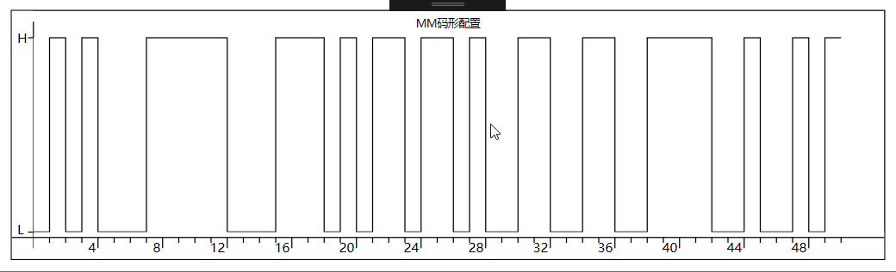
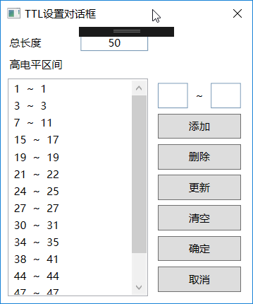

# IndustryControls4WPF

IndustryControls4WPF 是针对WPF的工控控件集合，正在持续开发中。目前已发布到 [NuGet](https://www.nuget.org/packages/IndustryControls4WPF/)。

本项目包括如下控件：

+ [x] TTL码形编辑控件


## 使用方法

### 1.TTLConfigurator (TTL码形编辑器)



配置方法和普通控件方式相似:

首先添加`xmln`引用

```xml
xmlns:digital="clr-namespace:IndustryControls4WPF.Controls.Digital;assembly=IndustryControls4WPF"
```

使用控件：

```xml
<digital:TtlConfigurator x:Name="TtlConfigurator" Margin="10" Title="MM码形配置" TtlString="01010001111100011101011011010011001100111100100101"></digital:TtlConfigurator>
```

使用非常简单，只需要配置`Title`和`TTLString`属性。

其中TTLString只需要配置`010101`这样的字符串即可。

运行时配置方法如下：

右击图形并点击配置码形，对话框如下



只需要指定高电平范围即可，其他默认低电平。

获取配置的码形结果可以有两种方式

1. TTLString

    获取TTLString对象，也是`010101`这样的字符串

2. TTLCells 对象

   TTLCells 对象获取了所有的码形配置信息，供之后使用。


## 帮助

Email: [spartajet.guo@gmail.com](mailto:spartajet.guo@gmail.com)